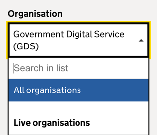
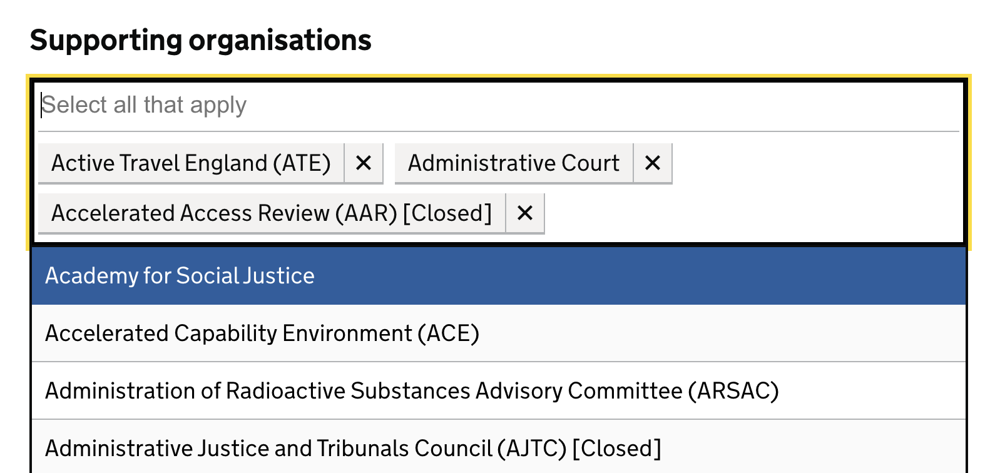

# Select-with-search component for publishing apps

A UI component that allows search on select:  



And also a multiselect variation: 



## Applicable usage

You have old design select components that you want to migrate to the new design system, but they:

- Have extremely long list of options that are difficult to scroll through
- Are multiselected options


## Installation

Make sure this line exists at the top of your Gemfile: 
```ruby
git_source(:github) { |repo| "https://github.com/#{repo}.git" }
```

Add this line to your application's Gemfile:
```ruby
gem "select_with_search_component", github: "alphagov/select-with-search-component"
```

And then execute:
```bash
$ bundle
```

Or install it yourself as:
```bash
$ gem install select_with_search_component
```

## Usage and Guidance

Documentation for component guidance is currently hosted on Whitehall: 
https://whitehall-admin.integration.publishing.service.gov.uk/component-guide/select_with_search 


## Testing

Running `rake` in this gem repository will run the following tasks, along with their individual rake task option if you want to run that task alone: 

- Rubocop: `rake rubocop`, or `rake rubocop:autocorrect` for correction, or `rake rubocop:autocorrect_all` for forced correction
- ERB lint: `bundle exec erb_lint --lint-all`
- Javascript lint: `yarn run lint`
- Ruby Minitests: `rake test`
- Jasmine tests: `rake jasmine` or `yarn run jasmine:ci`

## Licence

The gem is available as open source under the terms of the [MIT Licence](LICENSE)